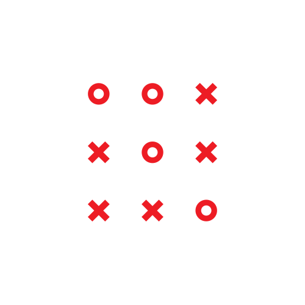

# Tic-Tac-Toe Game

🎮 A fun and interactive Tic-Tac-Toe game with an AI opponent!

  

## Description

📚 This program allows you to play Tic-Tac-Toe against an AI opponent. It uses the powerful Minimax algorithm to provide a challenging and strategic gameplay experience. The AI opponent is designed to make intelligent moves and provide a tough competition.

🔥 Challenge yourself and see if you can outsmart the AI in this classic game of Tic-Tac-Toe!

 
 

  

 
 

## Features

✨ Here are some of the features of this Tic-Tac-Toe game:

- Play against a smart AI opponent.
- Interactive and user-friendly interface.
- Keep track of the scores for each player.
- Option to play multiple rounds.
- Enjoy the thrill of winning or experiencing a tie.

 
 

## How to Play

📝 Follow these simple steps to start playing the game:

1. Enter the names of the two players.
2. The game starts with Player 1 (X) making the first move.
3. Players take turns placing their markers (X or O) on an empty spot of the 3x3 grid.
4. The goal is to get three markers in a row (horizontally, vertically, or diagonally).
5. If a player succeeds in getting three markers in a row, they win the game.
6. If all spots are filled without any player winning, the game ends in a tie.
7. After each game, the scores of the players will be displayed.
8. You can choose to play again or exit the game.

 
 

## Installation

🚀 To run this program on your local machine, follow these steps:

1. Clone the repository: `git clone https://github.com/your-username/tic-tac-toe.git`
2. Navigate to the project directory: `cd tic-tac-toe`
3. Compile the code: `g++ tic_tac_toe.cpp -o tic_tac_toe`
4. Run the program: `./tic_tac_toe`

 
 

## Requirements

⚙️ This program requires the following:

- C++ compiler (supporting C++11 or later)

 
 

## Acknowledgements

🙏 This Tic-Tac-Toe game is built using the minimax algorithm and inspired by the classic game we all love.

 
 

## License

📜 This project is licensed under the [MIT License](LICENSE).

 
 

🌟 Have fun playing Tic-Tac-Toe and enjoy your gaming experience! 🌟